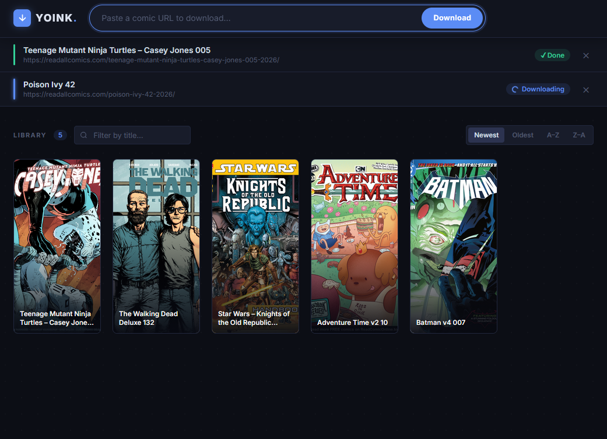
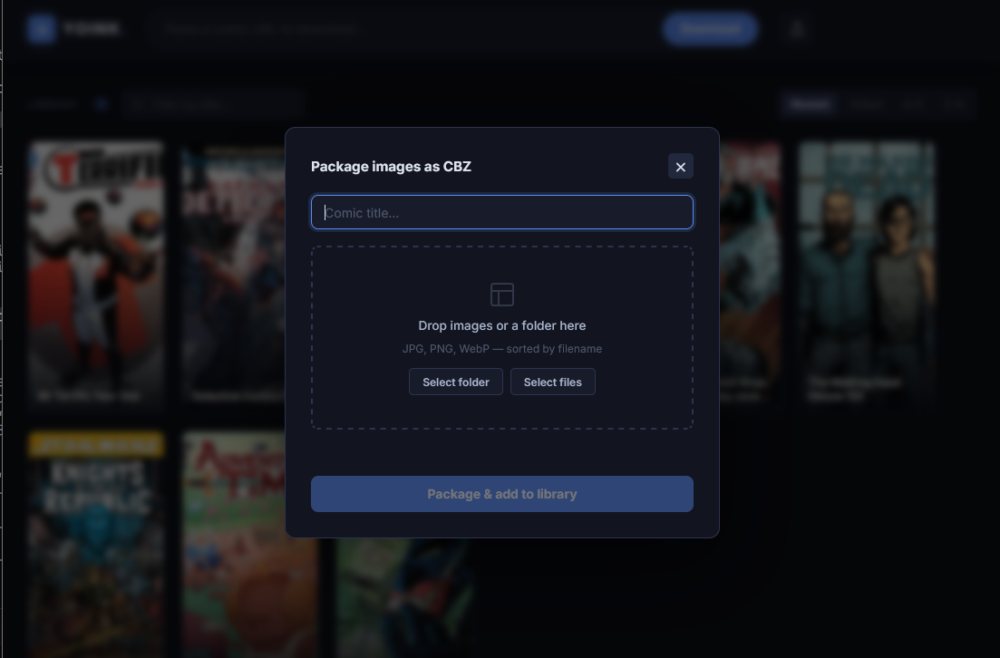

# yoink

A tool for downloading comics from readallcomics.com and packaging them as `.cbz` archives. Available as a CLI command or a self-hosted web application. The web UI also lets you package local image folders into `.cbz` archives directly from your browser.

## How it works

1. Fetches the comic page and extracts the title and image links
2. Downloads all pages concurrently with Cloudflare bypass
3. Packages the images into a `.cbz` (Comic Book Zip) archive
4. Cleans up downloaded images, keeping only the cover (`001`)

---

## Installation

### From source

Requires Go 1.22.3+:

```shell
go build -o yoink
```

### Pre-built binaries

Pre-built binaries for Linux (arm64) and Windows are available on the [releases page](https://git.brizzle.dev/bryan/yoink-go/releases).

### Docker

```shell
docker pull git.brizzle.dev/bryan/yoink-go:latest
```

---

## CLI

Download a single comic issue:

```shell
yoink <url>
```

**Example:**

```shell
yoink https://readallcomics.com/ultraman-x-avengers-001-2024/
```

The comic title is extracted from the page and used to name the archive. Output is saved to:

```
<library>/<Title>/<Title>.cbz
```

---

## Web UI

Yoink includes a self-hosted web interface for browsing and downloading comics from your browser.



### Running directly

```shell
yoink serve
```

By default the server listens on port `8080`. Use the `-p` flag to change it:

```shell
yoink serve -p 3000
```

### Running with Docker

A `docker-compose.yml` is included for quick deployment:

```shell
docker compose up -d
```

Or with Podman:

```shell
podman compose up -d
```

The web UI is then available at `http://localhost:8080`.

### Features

- **Download queue** — paste a comic URL into the input bar and track download progress in real time
- **Local packaging** — drag and drop a folder of images (or use the file picker) to package them as a `.cbz` archive and add it to your library without downloading anything
- **Library grid** — browse your comics as a 150×300 cover grid with title-initial placeholders for missing covers
- **Filter & sort** — filter by title and sort by newest, oldest, A–Z, or Z–A
- **One-click download** — click any cover to download the `.cbz` archive directly

#### Packaging local images



Click the upload icon (↑) in the header to open the packaging panel. Enter a title, then either:

- **Drag and drop** a folder or image files onto the drop zone
- **Select folder** to pick an entire directory at once
- **Select files** to pick individual images

Images are sorted by filename, the first image is used as the cover, and the result is saved to your library as `<Title>/<Title>.cbz`.

### Library volume

Downloaded comics are stored at the path set by `YOINK_LIBRARY`. When using Docker, mount this as a volume to persist your library across container restarts:

```yaml
# docker-compose.yml
services:
  yoink:
    image: git.brizzle.dev/bryan/yoink-go:latest
    ports:
      - "8080:8080"
    volumes:
      - ./library:/library
    environment:
      - YOINK_LIBRARY=/library
    restart: unless-stopped
```

---

## Configuration

| Variable        | Default    | Description                       |
|-----------------|------------|-----------------------------------|
| `YOINK_LIBRARY` | `~/.yoink` | Directory where comics are stored |

```shell
YOINK_LIBRARY=/mnt/media/comics yoink https://readallcomics.com/some-comic-001/
```

---

## Dependencies

- [goquery](https://github.com/PuerkitoBio/goquery) — HTML parsing
- [cloudflare-bp-go](https://github.com/DaRealFreak/cloudflare-bp-go) — Cloudflare bypass
- [cobra](https://github.com/spf13/cobra) — CLI framework
